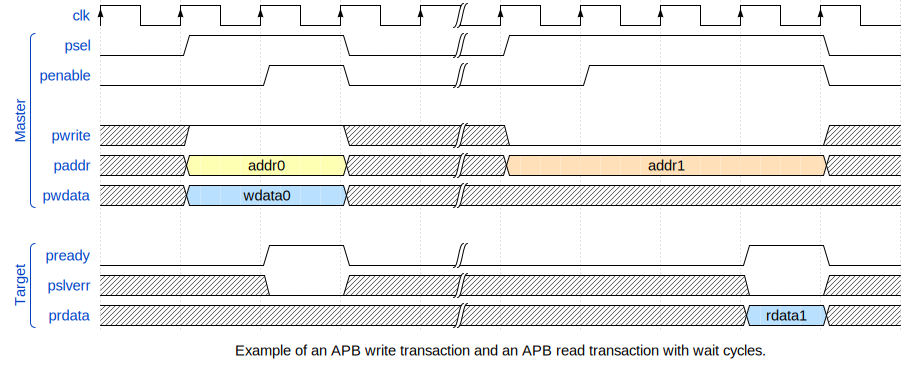

# CSR Adapter Generator

A CSR (Control and Status Register) is a register used to configure, control, and monitor hardware components in a digital system, typically within processors, peripherals, or custom IP blocks. They form the software-visible interface to hardware functionality in addition to the instruction set. In the case of RISC-V, architectural CSR's are accessed through dedicated instructions, for instance to configure interrupts. A more typical example, however, are memory-mapped CSR's which are accessed through standard load/store instructions, which could provide access to peripherals, accellerators or platform configuration mechanisms. 

When designing a system, the definition of CSR's and their mapping into an address space has to be defined early on, such that both hardware and software components can be developed in parallel. However, requirements are often subject to change and the CSR specification may need to be updated. This can lead to a tedious and error-prone process of manually updating several *views* of the same information such as the RTL implementation, verification infrastructure, software components and documentation.

The solution is to have one formal description of the CSR's and generate all other views such as RTL and documentation from this single source of truth. Since IP blocks are often reused across different projects, the CSR specification at the system level should be composable such that CSR's of different IP blocks can be combined into a single address space.

While standards such as [SystemRDL](https://en.wikipedia.org/wiki/SystemRDL) and [IP-XACT](https://en.wikipedia.org/wiki/IP-XACT) as well as tools like [PeakRDL](https://peakrdl.readthedocs.io/en/latest/index.html) exist to solve exactly this problem, the reality is that many companies and projects use ad-hoc solutions such as spreadsheets or even text documents to define CSR's. 

In this lab, you will create a simple tool to generate CSR adapters from a spreadsheet description of CSR's. A reference implementation is provided in Python. You will implement the equivalent generator in Chisel, showcasing the power of combining an embedded hardware DSL and Scala's unrestricted programming capabilities, opposed to a traditional HDL or ad-hoc generator scripts.

## The CSR Adapter

The CSR adapter is the generated hardware module which bridges between a memory-mapped bus interface (e.g. APB) and the internal signals of the IP blocks (e.g. the ready flag of a UART). An example system containing a CSR adapter is shown below:


## CSR Specification

The CSR specification is provided in Excel spreadsheets. For each IP block, a separate sheet named after the block provides the CSR definition for that block. Registers have a name and an offset from the base address of the block. Each register can have multiple fields. If no subfields exist, the field name is left blank. A whole register or a field can have one of the following types:
* `rw`: software can read and write, hardware can read
* `ro`: software can read, hardware provides the value
* `wotrg`: software can only write, sending an event to the hardware in addition to the written value
* `rotrg`: software can only read, sending an event to the hardware, which in turn provides the value
* `const`: software can only be read, the value is hardwired inside the CSR adapter

An example CSR definition is shown below:

| Register  | Offset | Field   | Type   | Range   | Init        |
|-----------|--------|---------|--------|---------|-------------|
| myReg0    | 0x0    | foo     | rw     | 11:0    | 0x123       |
| myReg0    | 0x0    | bar     | ro     | 31:12   | ?           |
| myReg1    | 0x4    |         | rw     | 7:0     | 0x7         |
| myWrTrg   | 0x8    | baz     | wotrg  | 7:0     | ?           |
| myRdTrg   | 0xC    | qux     | rotrg  | 15:0    | ?           |
| myConst   | 0x10   |         | const  | 31:0    | 0xcafebabe  |

The spreadsheet called `Map` defines the memory map of the system. Each row defines an instance of an IP block with a `Block` type, a unique `Name` and an address range. Additional fields such as the interace type or whether the block is cacheable or executable are not used in this lab, but could be used in a more advanced implementation to generate different types of adapters or additional documentation.

An example memory map is shown below:

| Block         | Name    | Interface | Base Address | End Address | Cacheable | Executable | Description      |
|---------------|---------|-----------|--------------|-------------|-----------|------------|------------------|
| MyBlock       | block0  | APB       | 0x1000       | 0x10FF      | no        | no         | my block         |
| MyOtherBlock  | block1  | APB       | 0xFF0000     | 0xFF0FFF    | no        | no         | my other block   |


## The Adapter Interface

The adapter in this lab uses an APB interface to connect to the system bus. APB is a simple low perfomance bus protocol commonly used for memory-mapped peripherals. An APB transaction consists of at least two cycles: In the setup phase, `psel` is asserted and the address and potential write data are provided. In the following access phase, `penable` is also asserted and the target either signals `pready` to indicate that the transaction is complete immediately or waits any number of cycles before asserting `pready`. Alongside `pready`, the target provides the read data and an error signal to indicate the success of the transaction. An APB write transaction without wait cycles and read transaction with two wait cycles is shown below:



It is the responsibility of the CSR adapter to comply with the APB handshaking.

Each CSR field/register type has different inputs and outputs to the IP block that it connects to:
- `rw`:
  - `block.reg(.field): Output[UInt(<width>)]`: output from adapter to block
- `ro`:
  - `block.reg(.field): Input[UInt(<width>)]`: input from block to adapter
- `wotrg`:
  - `block.reg(.field).data: Output[UInt(<width>)]`: output from adapter to block
  - `block.reg(.field).trg: Output[Bool]`: event trigger output
- `rotrg`:
  - `block.reg(.field).data: Input[UInt(<width>)]`: input from block to adapter
  - `block.reg(.field).trg: Output[Bool]`: event trigger output
- `const`:
  - no connection to block

## The Chisel Generator

A small abstraction layer for loading the Excel sheets is provided. Calling `Sheet.load` loads all sheets into a `Map[String, Sheet]`, where the key is the sheet name. Each `Sheet` provides methods to access columns by name and filter rows. An example usage is shown below:

```scala
val sheets = Sheet.load("soc.xlsx")
val uart = sheets("Uart")
println(uart) // prints table
val regs = uart.column("Register") 
println(regs) // prints list of register names
val reg0 = regs.head // first register
val reg0Rows = uart.filterRows(row => row(0) == reg0) // all rows for that register
val fieldNames = reg0Rows.map(row => row(2))
println(fieldNames) // prints list of field names for that register
```

Feel free to structure the data further into your own data types to make it easier to work with. E.g.:

```scala
case class Register(name: String, offset: Int, fields: Seq[Field])
case class Field(name: String, typ: FieldType, range: (Int, Int), init: ...)
```

Since the IO of the generated adapter depends on the CSR specification and is therefore only determined at runtime, a way to create Chisel `Bundles` with runtime-determined fields is needed. The provided `DynamicBundle` class allows you to do exactly that. I takes a list of field name and Chisel type tuples and creates a `Bundle` with those fields. An example usage is shown below:

```scala
val myBundle = new DynamicBundle(for (i <- 0 until 4) yield s"field$i" -> UInt(i.W))
myBundle.elements.foreach { case (name, data) =>
  println(s"$name: ${data.getWidth} bits")
}
myBundle("field3") := 7.U
```

With this, you are all set to implement the generator. The `Module` class `CsrAdapter` is provided as a starting point:

```scala
class CsrAdapter(descriptionSheetPath: String) extends Module {
  val sheets = Sheet.load(descriptionSheetPath)

  val apb: ApbPort // APB interface
  val csr: DynamicBundle // contains all CSR's as fields

}
```

### Using the python generator

A reference implementation of the generator is provided in Python. You can run it as follows:

```bash
python3 generate_csr.py soc.xlsx
```

Take a look at the Excel source file `soc.xlsx`, the generated Verilog file `soc_adapter.sv` and finally the generator itself.

## Implementing the Chisel Generator

Using the python generator as a reference, implement the circuit generator in Chisel. Before starting, consider the following questions:

- How will you implement the APB protocol?
- What state elements will reside *inside* the CSR adapter?
- How will you handle read and write accesses to the CSR's?
- How will you handle the different CSR types?
- How will you structure your module implementation?
- How will you organize your data, such that it suits your implementation best?
- How will you test your implementation?

